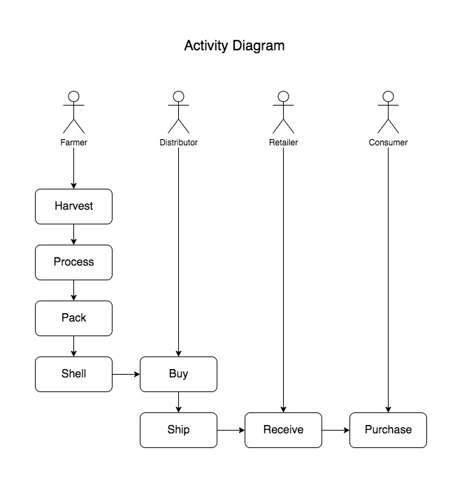
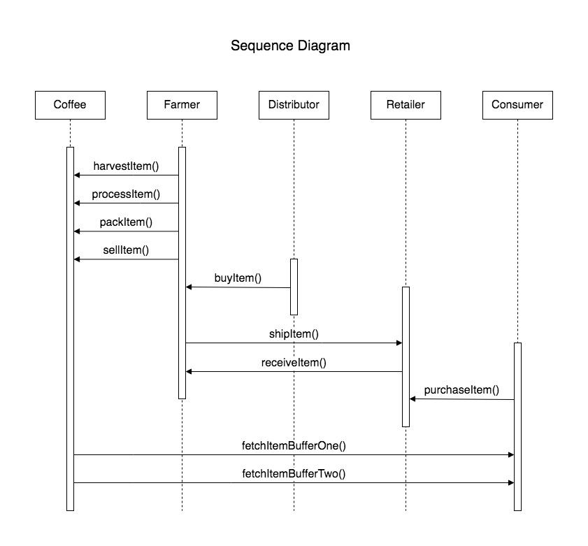
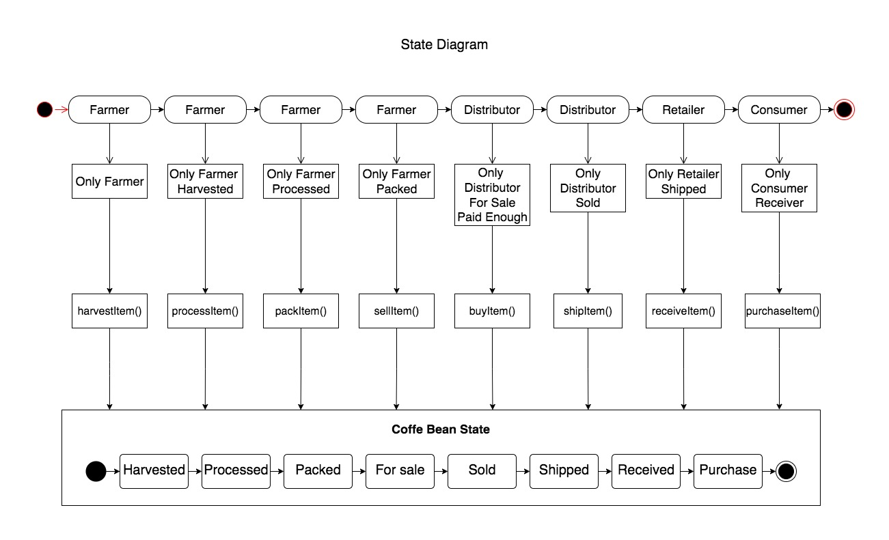
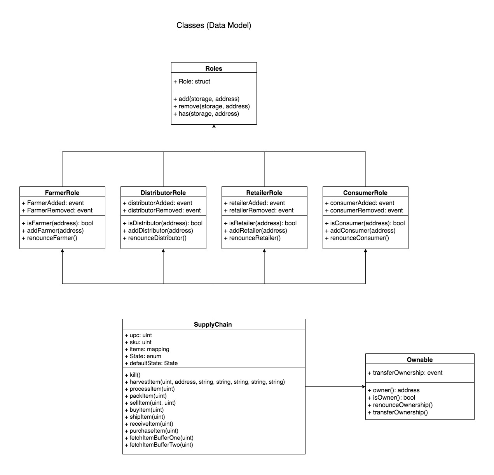

## Ethereum Dapp for Tracking Items through Supply Chain
Implementation of Dapp Ethereum, demonstrating use for a supply chain of coffee, from harvest by the farmer to purchase by the consumer.
This repositorio have with base the [project](https://github.com/udacity/nd1309-Project-6b-Example-Template) provided by Udacity Nanodegree Blockchain Developer course.

## Rinkeby Network Details

Transaction: [0x7e0501403079df16a6270cffba4664361bf51df7e6782d317dbde58bd82c50c6](https://rinkeby.etherscan.io/tx/0x7e0501403079df16a6270cffba4664361bf51df7e6782d317dbde58bd82c50c6)

Contract address: [0xEf75f0749cC65b54a88A0b5181E006841B1323E5](https://rinkeby.etherscan.io/address/0xEf75f0749cC65b54a88A0b5181E006841B1323E5)

### Transaction History

* Harvested - [0xf01c98898dfc60e35e66bf2d3a284c9d1e0481d0ddea1a4d6e3cbfa4c7ce3fbe](https://rinkeby.etherscan.io/tx/0xf01c98898dfc60e35e66bf2d3a284c9d1e0481d0ddea1a4d6e3cbfa4c7ce3fbe)
* Processed - [0xa9f619be47d0248696c9c1838b2a0f2196f3c05d13057b4a1e41c1a1211b0e9c](https://rinkeby.etherscan.io/tx/0xa9f619be47d0248696c9c1838b2a0f2196f3c05d13057b4a1e41c1a1211b0e9c)
* Packed - [0xfc0601b7cf9428bdf6cae7e0370e6844d9f0a95e949c425a1d1ccf7d97412feb](https://rinkeby.etherscan.io/tx/0xfc0601b7cf9428bdf6cae7e0370e6844d9f0a95e949c425a1d1ccf7d97412feb)
* ForSale - [0x6c1c4d3a89df1e8cb9ab126ea53a337d0a7839ba621e3a2ceebd0eead35ea93b](https://rinkeby.etherscan.io/tx/0x6c1c4d3a89df1e8cb9ab126ea53a337d0a7839ba621e3a2ceebd0eead35ea93b)
* Sold - [0x1c4d71b2478575f12f573bf5b5ccdb984a16b17341c0e32cd6461d0e82209986](https://rinkeby.etherscan.io/tx/0x1c4d71b2478575f12f573bf5b5ccdb984a16b17341c0e32cd6461d0e82209986)
* Shipped - [0xd2bb7d3a7ae686bac997f87fe6bb0ab1e0abef01aeff8c85309becc9b23d69ba](https://rinkeby.etherscan.io/tx/0xd2bb7d3a7ae686bac997f87fe6bb0ab1e0abef01aeff8c85309becc9b23d69ba)
* Received - [0x84d1ecfa43835139d8e455db824b1dd03c13b693921b669d9fe43c5abe0907d0](https://rinkeby.etherscan.io/tx/0x84d1ecfa43835139d8e455db824b1dd03c13b693921b669d9fe43c5abe0907d0)
* Purchased - [0xc68094b5b4f05025753c752692fac26ed9b2f82842d30748498fb19ec554397d](https://rinkeby.etherscan.io/tx/0xc68094b5b4f05025753c752692fac26ed9b2f82842d30748498fb19ec554397d)

## Built With
- [Truffle](https://trufflesuite.com/docs/truffle/): v4.1.14 (core: 4.1.14)
- [Solidity](https://docs.soliditylang.org/en/v0.8.12/): v0.4.24 (solc-js)
- [Node](https://nodejs.org/en/docs/): v10.3.0
- [Web3](https://web3js.readthedocs.io/en/v1.7.0/index.html#): v0.20.6

## UML

### Activity Diagram

### Sequence Diagram

### State Diagram

### Classes Diagram (Data Model)
